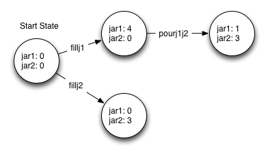

The Water Jug Problem
=====================

Write a program to solve the following problem: You have two jugs: a 4-gallon jug and a 3-gallon jug. Neither of the jugs have markings on them. There is a pump that can be used to fill the jugs with water. How can you get exactly two gallons of water in the 4-gallon jug?

The key to this problem is in using something called a state:

*  A state represents the amount of water in each of the jugs.  You should create a class called State or something similar.  The State class will remember how much water is in each jug.  The following diagram illustrates some states:

* The solution to this problem will be a list of states.

* A key to solving this problem recursively is that there are multiple parts to a base case.  There is the True part where the state you have just created is the same as the goal state.  There is a False part to the base case where the state you have just created is already on the list.

To Make it clear what you are doing you will want to implement the following methods:

* ``__init__`` -- Initialize the state, you should be able to specify the amount of water that is initially in each jug. This is particularly important to specify the goal state.
* ``filljug1`` -- fill jug1 to capacity from the pump
* ``filljug2`` -- fill jug2 to capacity from the pump
* ``emptyjug1`` -- pour the water from jug1 onto the ground
* ``emptyjug2`` -- pour the water from jug2 onto the ground
* ``pourjug1jug2`` -- pour as much water as you can from jug1 to jug2 without spilling
* ``pourjug2jug2`` -- pour as much water as you can from jug2 to jug1 without spilling

These methods will also be useful

* ``__eq__``  test if one jug is equal to another
* ``__str__`` make an easy to understand representation of the state.

Your main program should look something like this::

    goal = State(2,0)  # 2 gallons in the 4 gallon jar, 0 in the other
    start = State(0,0) # both jars start out empty
    moves = []
    search(moves,start,goal)
    # when search returns moves will contain the sequence of states.
    print [str(x) for x in moves]

Grading
-------

* Correct Implemenation of a State class -- 10 points
* Working search, written recursively -- 15 points
* All code written with good style with code broken up into appropriate functions -- 5 points
* Total:  30 points

.. admonition:: Note

   This program should not be too long.  It can easily be written in less than 100 lines of code.  If you find yourself over that you are making it too hard on yourself.

Extra Credit
~~~~~~~~~~~~

* Modify the code so that the size of the two jars can be specified as parameters -- 5 points
* Can you devise a way to remove or avoid useless states.  For example one solution to the original problem contains the following states::

    ['(0, 0)', '(4, 0)', '(4, 3)', '(0, 3)'...

  Clearly the (4, 0) and (4, 3) states are just meaningless work. -- 5 points

Deadline
--------

The project is due by April 13 at 5pm
